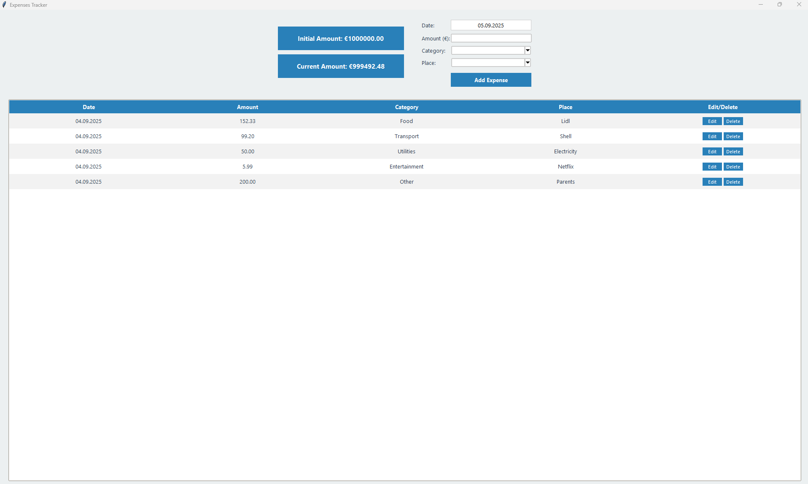

# 💸 Budget Tracker

A simple and interactive **Tkinter-based Budget Tracker** application to help you track expenses, set an initial budget, and monitor your current balance — all from a clean, user-friendly GUI. Data is saved locally, and the app works fully offline.

---



## 📦 Features

- ✅ Add, edit, and delete expense entries
- ✅ Set and modify the initial budget amount
- ✅ Automatic current balance calculation
- ✅ Calendar-based date selection
- ✅ Hover effects and zebra striping for rows
- ✅ Persistent data storage between sessions
- ✅ Smart place suggestions based on past entries

---

## ▶️ How to Run

1. **Install Python 3.7 or later.**

2. **Install required packages:**

   The only external dependency is `tkcalendar`.

   ```bash
   pip install tkcalendar
   ```

3. **Run the app:**

   Make sure you're in the project folder and run:

   ```bash
   python main.py
   ```

   The application window will open immediately.

---

## 🖥️ User Interface Overview

- **Initial Amount Button**: Click to enter or update your starting budget.
- **Current Amount Button**: Displays the remaining balance after expenses.
- **Date Button**: Opens a calendar popup to pick a date for the expense.
- **Amount Field**: Input the cost of the expense.
- **Category Dropdown**: Choose from predefined categories (e.g. Food, Transport).
- **Place Entry**: Enter or select the place of the transaction. Frequently used places are suggested.
- **Add Button**: Adds the new expense to the list.
- **Expense Table (Treeview)**:
  - Shows Date, Amount, Category, and Place.
  - Each row includes **Edit** and **Delete** buttons that float above the table.
  - Rows are zebra-striped for readability and highlight on hover or when selected.

---

## 💾 Data Persistence

All user data — including:
- Initial budget changes
- All expenses

...is saved locally on your machine using Python’s `pickle` module. When you reopen the app, everything will be restored exactly as you left it.

No internet connection is required.

---

## 📁 File Structure

```
budget-tracker/
│
├── main.py            # ✅ Entry point to launch the application
├── app.py             # Contains the main BudgetTracker class
├── models.py          # Defines Expense and InitialChange data classes
├── storage.py         # Handles saving/loading data using pickle
├── README.md          # You're here!
└── assets/            # (Optional) Icons, themes, etc.
```

---

## 🧑‍💻 Requirements

- Python **3.7** or newer
- OS: **Windows**, **macOS**, or **Linux**
- Dependencies:
  - `tkinter` (built-in with Python)
  - `tkcalendar` (install via pip)

---

## 📜 License

This project is provided for **personal and educational use**. You are free to modify, extend, and use the code as needed.

---

## 🙋‍♂️ Support

If you encounter issues:

- Make sure you're using a compatible version of Python.
- Double-check that `tkcalendar` is installed.
- Ensure you’re running from `main.py` in your local environment — not in an online interpreter.

